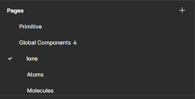
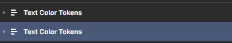
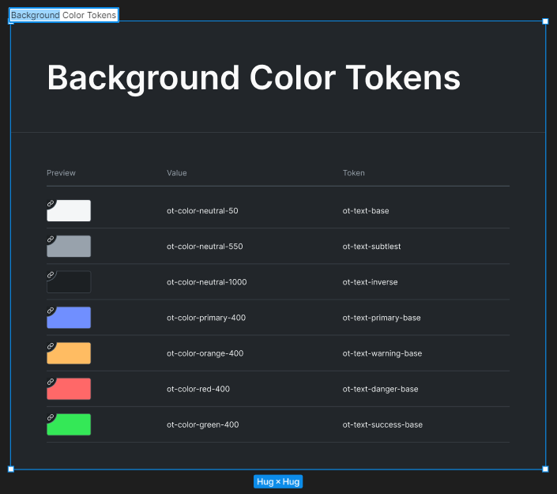
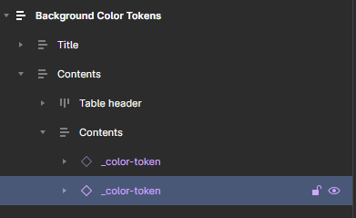
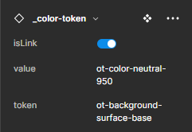
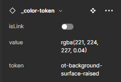
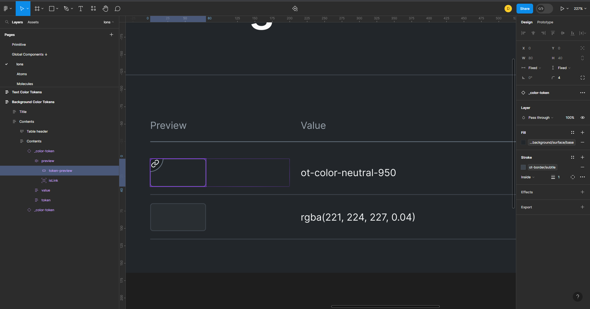

# Design Tokens

This repo will generate tokens from figma design. This function still Work In Progress (WIP), but still can be used to generate some palette for scss and json file.

## How to edit color palette

For now, if you want to change or add, you must follow the rules. If not, then the generator will not run properly.

> **Color palette can only be edited on the "Primitive" page**
>
> 

### Adding shade to color palette

1. Copy paste "Color Card" component. Make sure the copy is on "Colors" frame.


2. Edit props on component "Color Card" (must use "Color Card" component).


3. Click rectangle on "Color Card" component. Then edit fill prop.


### Adding variant to color palette

1. Copy paste "Section" frame. Make sure the copy is on "Content" frame.


2. Edit the title.


3. Then follow "[adding shade to color palette](#adding-shade-to-color-palette)".

## How to edit color tokens

For now, if you want to change or add, you must follow the rules. If not, then the generator will not run properly.

> **Color token can only be edited on the "Ions" page**
>
> 

### Adding color token category

1. Copy paste "Text Color Tokens" frame.



2. Edit frame title. Make sure you don't delete "Color Tokens" on the title.



3. Then follow "[adding color token variant](#adding-color-token-variant)"

### Adding color token variant

1. Copy paste "\_color-token" component. Make sure the copy is on "Contents" frame.



2. Edit the props.

- Enable "isLink" if the token value is related to existing token or palette



- Disabled "isLink" if the token value is color value (RGBA, HEX, or HSL)



3. Click rectangle on "\_color-token" component (token-preview). Then edit fill prop.



## Generating tokens

Follow this commands to generate the tokens.

1. First, install the dependencies.

```bash
yarn install
```

2. Then, run generate command.

```bash
yarn run generate
```

3. See the result on [`./src/results`](./src/results/) folder.
